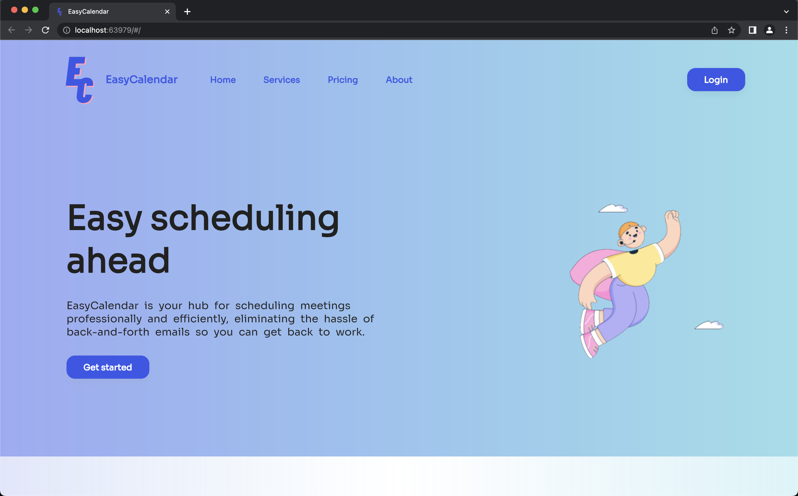

<div align="center" id="top"> 
  &#xa0;
</div>

<p align="center">
  
</p>

<h1 align="center">Easy Calendar</h1>

<p align="center">
  

  

  

<h1 align="center">
    
</h1>

<p align="center">
  <a href="#dart-about">About</a> &#xa0; | &#xa0; 
  <a href="#white_check_mark-requirements">Requirements</a> &#xa0; | &#xa0;
  <a href="#checkered_flag-starting">Starting</a> &#xa0; | &#xa0;
  <a href="https://github.com/MatheusChein" target="_blank">Author</a>
</p>

<br>

## :dart: About ##

EasyCalendar - An app developed in Flutter to allow candidates to schedule time with tech recruiters seamlessly.

## :white_check_mark: Requirements ##

Before starting :checkered_flag:, you need to have [Flutter](https://docs.flutter.dev/get-started/install?gclsrc=ds&gclsrc=ds) installed.

## :checkered_flag: Starting ##

```bash
# Clone this project
$ git clone https://github.com/MatheusChein/flutter-landing-page.git

# Access
$ cd flutter-landing-page

# Install dependencies
$ flutter pub get

# Run the project
$ flutter run -d chrome

# The app will initialize in the a new Chrome window
```

Made with :heart: by <a href="https://github.com/MatheusChein" target="_blank">Matheus Chein</a>

&#xa0;

<a href="#top">Back to top</a>
